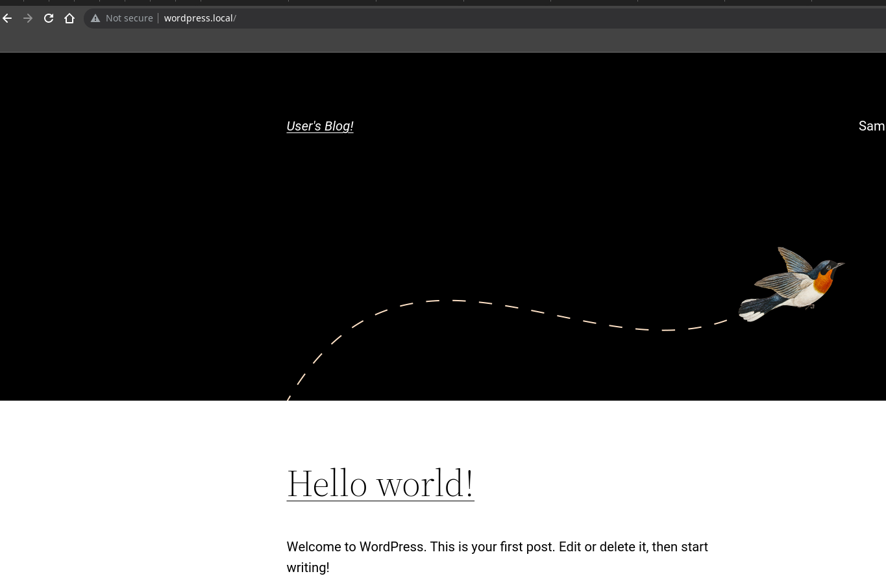
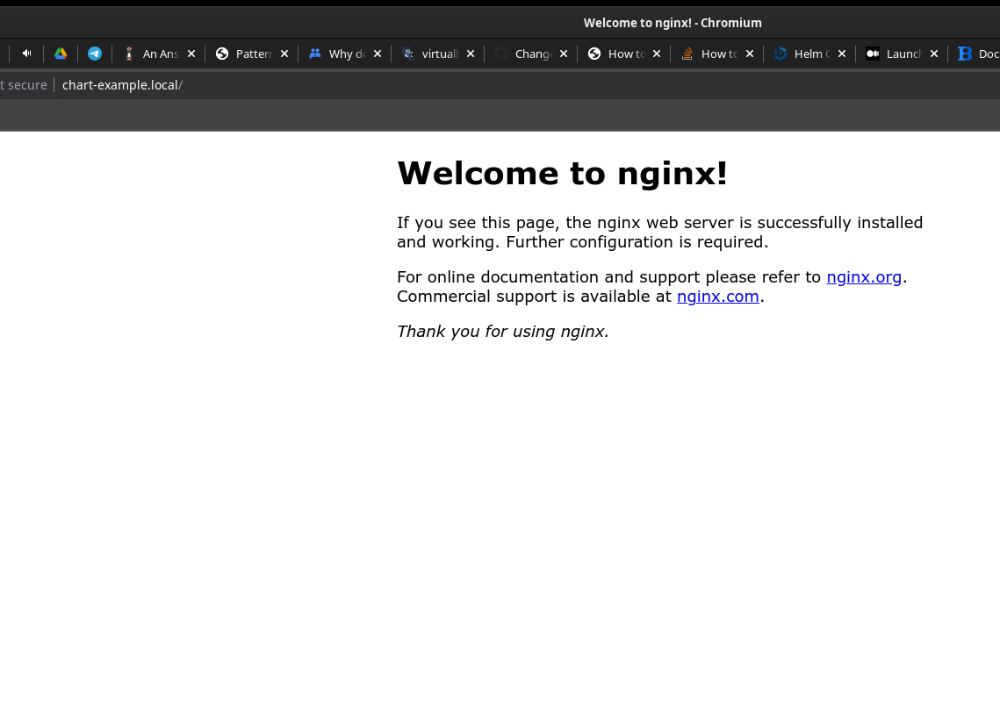
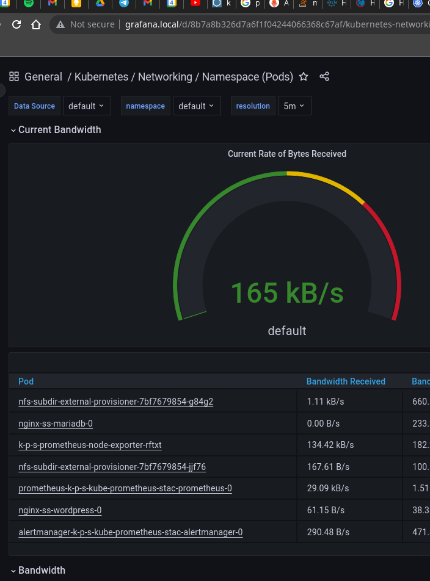

**Basic**
[X] Preparazione di due VMs Vagrant (comunicazione su rete interna della vostra workstation) o su Hypervisor KVM o su qualche cloud provider.

Usato Vagrantfile per deploy 2 debian bullseye 2 schede di rete per comunicazione.

[/] Installazione di un cluster K8s tramite RKE1 (un master e un worker) o K3s2 (il più leggero) o Kubeadm3 (preffered ma più complesso. Nella CKA ci sono le ops con kubeadm).

Usato microk8s (più vicino a kubeadm, escludendo la parte dei crt). Usato Ansible chart cucinato.

[X] Installazione di applicativi a vostra scelta tramite HELM (aggiungere anche ingress Nginx per esporla via http
esternamente).

Installato un wordpress e un mediawiki

[X] Scrittura di un Helm chart minimale. Giusto un deplyoment, un service, ingress e un po' di settaggi dal values.yaml.

Usato testchart con qualche valore

[X] Installazione NFS su uno dei due nodi (va bene anche GlusterFS ma non HostPath).

Installato glusterFS sui due nodi, creato un volume gv0, installato ganesha-nfs, installato chart per usare una subdirectory di nfs come persistent, ha già l'archivedirectory abilitato di default (retain).

[X] Setup di volumi persistenti che utilizzino il server NFS installato nei punti precedenti.

Reinstallato wordpress usando lo storageClass "nfs-client"

[X] Creazione di pod stateful che utilizzino uno o più volumi creati nel punto precedente (dopo il kill dei pod i dati devono persistere)

[ ] Installazione Kube Prometheus Stack4 per il monitoring dei nodi e dei pod (visualizzare correttamente le metriche in Grafana)

**Advanced**

[X] Creare un pod che legga i dati da una configmap. Va benissimo anche utilizzare busybox e leggere correttamente i valori della configmap montata. Preferibilmente fare tutto tramite Helm (compreso creare la configmap)

[X] Come sopra, ma stavolta deve leggere dati da una secret. Anche in questo caso fare tutto tramite Helm. 

Creato chart minimale con nginx con configmap e secret (password autogenerata), montata come volume in /
